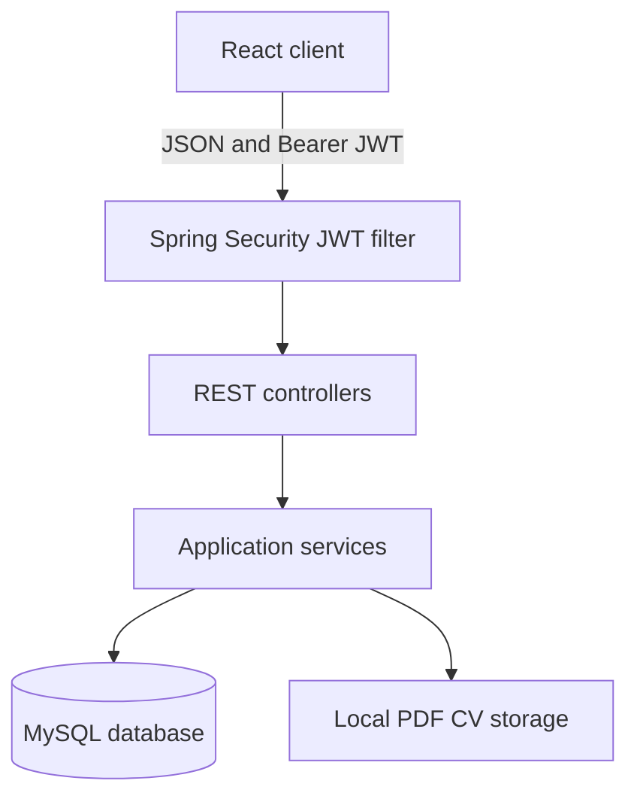

<p align="center">
  
</p>

<h1 align="center">UniConnect</h1>

<p align="center">
  A modern internship and talent platform connecting university students with companies.
</p>

<p align="center">
  
  
  
  
  
</p>

## Overview

UniConnect is a full-stack web application designed to manage the complete internship process in one place. Students can build professional profiles, upload CVs, discover opportunities, save internships, submit applications, and track decisions. Companies can publish internships, review candidates, download CVs, and manage application statuses. Administrators can monitor platform activity and moderate users and internship listings.

The project uses a React frontend, a Spring Boot REST API, MySQL persistence, and stateless JWT authentication. It includes responsive layouts, mobile navigation, dark mode, notifications, analytics, validation, and role-based access control.

## Main Features

### Student workspace

- Register and sign in securely
- Create and update a student profile
- Manage education records and skills
- Upload, download, and remove a PDF CV
- Browse, search, filter, sort, and paginate internships
- Save and remove bookmarked internships
- Apply to open internships
- Prevent duplicate and late applications
- Track application status and timeline history
- View dashboard analytics and profile completion
- Receive application status notifications
- Update account details, password, and account status

### Company workspace

- Create and update a company profile
- Publish, edit, and delete owned internships
- View company internship statistics
- Review applications for company-owned internships
- Open complete candidate profiles
- Review candidate education and skills
- Download candidate PDF CVs
- Move applications through the recruitment process
- Receive notifications when students apply
- Manage account settings securely

### Administrator workspace

- View platform totals for users, students, companies, internships, and applications
- Review registered users and their account state
- Activate or deactivate user accounts
- Remove unsuitable internship listings
- Prevent administrators from deactivating their own active account

### Shared experience

- Role-based dashboards and protected routes
- Responsive desktop, tablet, and mobile layouts
- Mobile navigation drawer and touch-friendly controls
- Light and dark themes with saved preference
- Loading, success, error, and empty states
- Notification center with unread count
- Secure logout and expired-session handling

## Application Roles

| Role | Main purpose |
| --- | --- |
| `STUDENT` | Builds a portfolio, discovers internships, applies, and tracks progress |
| `COMPANY` | Publishes internships, reviews candidates, and updates application statuses |
| `ADMIN` | Monitors activity and moderates users and internships |

## Technology Stack

| Layer | Technology |
| --- | --- |
| Frontend | React 19, Vite 8, React Router 7 |
| Styling | Tailwind CSS 4 and custom responsive CSS |
| HTTP client | Axios with JWT request interceptor |
| Backend | Spring Boot 4.1.1 and Java 24 |
| Security | Spring Security, BCrypt, JJWT 0.13 |
| Persistence | Spring Data JPA and Hibernate |
| Database | MySQL 8 |
| Build tools | Maven Wrapper and npm |
| Development tools | IntelliJ IDEA, MySQL Workbench, Postman, Git |

## System Architecture



The frontend sends REST requests through a shared Axios client. The JWT filter validates protected requests and creates the Spring Security authentication context. Controllers validate input and delegate business rules to services. Spring Data repositories store application data in MySQL, while uploaded CV files are stored outside the database.

## Project Structure

```text
UniConnect/
├── backend/
│   ├── src/main/java/com/uniconnect/backend/
│   │   ├── config/          Security, JWT, CORS, and admin initialization
│   │   ├── controller/      REST API controllers
│   │   ├── dto/             Validated request and response models
│   │   ├── entity/          JPA entities and enumerations
│   │   ├── exception/       Centralized API error handling
│   │   ├── repository/      Spring Data JPA repositories
│   │   └── service/         Business logic and file storage
│   └── src/main/resources/
│       └── application.properties
├── frontend/
│   ├── public/              Public icons and branding assets
│   └── src/
│       ├── api/             Shared Axios configuration
│       ├── assets/          Application images
│       ├── components/      Reusable layouts and UI components
│       ├── pages/           Student, company, admin, and auth pages
│       └── utils/           Shared helper functions
├── docs/                    Project documentation in Word format
└── README.md
```

## Database Model

| Table | Purpose |
| --- | --- |
| `users` | Account identity, password hash, role, active state, and creation time |
| `students` | Student profile, contact details, biography, and CV metadata |
| `companies` | Company profile and contact information |
| `education` | Student education history |
| `skills` | Reusable unique skill names |
| `student_skills` | Many-to-many relationship between students and skills |
| `internships` | Company internship opportunities |
| `applications` | Student applications and current statuses |
| `application_status_history` | Chronological application status changes |
| `saved_internships` | Student internship bookmarks |
| `notifications` | User notifications and read state |

Hibernate creates and updates these tables from the JPA entity definitions when the backend starts.

## Getting Started

### Prerequisites

Install the following tools before running the project:

- Java Development Kit 24
- MySQL Community Server 8
- Node.js with npm
- Git
- IntelliJ IDEA or another Java IDE
- MySQL Workbench, optional
- Postman, optional

### 1. Clone the repository

```powershell
git clone https://github.com/Kumarathunga2003/UniConnect.git
cd UniConnect
```

### 2. Create the MySQL database

Start MySQL, open MySQL Workbench, and run:

```sql
CREATE DATABASE uniconnect
    CHARACTER SET utf8mb4
    COLLATE utf8mb4_0900_ai_ci;
```

The backend connects using the `root` MySQL account by default. The password is read from the `DB_PASSWORD` environment variable.

### 3. Configure environment variables

Set permanent Windows user environment variables from PowerShell. Replace every example value before running the project.

```powershell
[Environment]::SetEnvironmentVariable(
    "DB_PASSWORD",
    "YOUR_MYSQL_PASSWORD",
    "User"
)

[Environment]::SetEnvironmentVariable(
    "JWT_SECRET",
    "A_RANDOM_SECRET_WITH_AT_LEAST_48_CHARACTERS",
    "User"
)
```

Close and reopen IntelliJ and PowerShell after setting permanent variables.

To verify that the current terminal received them:

```powershell
echo $env:DB_PASSWORD
echo $env:JWT_SECRET
```

Never commit or publish the real values.

#### Optional administrator account

Public registration allows only `STUDENT` and `COMPANY` accounts. To create an administrator, set these variables before starting the backend:

```powershell
[Environment]::SetEnvironmentVariable(
    "ADMIN_EMAIL",
    "admin@example.com",
    "User"
)

[Environment]::SetEnvironmentVariable(
    "ADMIN_PASSWORD",
    "YOUR_SECURE_ADMIN_PASSWORD",
    "User"
)
```

The backend creates the administrator only when both values are valid and the email does not already exist. The administrator password must contain at least eight characters.

### 4. Run the backend

#### IntelliJ IDEA

1. Open the `backend` directory as a Maven project.
2. Open the Maven tool window.
3. Select **Reload All Maven Projects**.
4. Wait for dependency downloads to finish.
5. Run `BackendApplication.java`.

#### PowerShell

```powershell
cd backend
.\mvnw.cmd spring-boot:run
```

The backend starts at:

```text
http://localhost:8080
```

Verify it using:

```text
http://localhost:8080/api/health
```

### 5. Run the frontend

Open another PowerShell terminal from the repository root:

```powershell
cd frontend
npm install
npm run dev
```

Open the application at:

```text
http://localhost:5173
```

The frontend uses `http://localhost:8080/api` as its default API URL.

#### Optional frontend environment file

To use another backend URL, copy the example environment file or create `frontend/.env`:

```env
VITE_API_URL=http://localhost:8080/api
```

Do not commit the real `.env` file.

## Local URLs

| Service | URL |
| --- | --- |
| Frontend | `http://localhost:5173` |
| Backend | `http://localhost:8080` |
| Health check | `http://localhost:8080/api/health` |
| API base URL | `http://localhost:8080/api` |

## API Overview

Public endpoints do not require authentication. All other endpoints require an `Authorization: Bearer <token>` header.

### Authentication and account

| Method | Endpoint | Access | Purpose |
| --- | --- | --- | --- |
| `GET` | `/api/health` | Public | Check backend availability |
| `POST` | `/api/auth/register` | Public | Register a student or company |
| `POST` | `/api/auth/login` | Public | Sign in and receive a JWT |
| `GET` | `/api/account` | Authenticated | Get signed-in account details |
| `PUT` | `/api/account` | Authenticated | Update name or email |
| `PUT` | `/api/account/password` | Authenticated | Change the password |
| `DELETE` | `/api/account` | Authenticated | Deactivate the account |

### Student profile and portfolio

| Method | Endpoint | Purpose |
| --- | --- | --- |
| `GET`, `PUT` | `/api/students/profile` | Retrieve or save the student profile |
| `GET`, `POST` | `/api/students/education` | List or create education records |
| `PUT`, `DELETE` | `/api/students/education/{id}` | Update or delete owned education records |
| `GET`, `PUT` | `/api/students/skills` | Retrieve or replace the student skill list |
| `GET` | `/api/students/cv/info` | Check CV availability |
| `POST`, `GET`, `DELETE` | `/api/students/cv` | Upload, download, or remove a PDF CV |
| `GET` | `/api/students/saved-internships` | List saved internships |
| `POST`, `DELETE` | `/api/students/saved-internships/{id}` | Save or remove an internship bookmark |

### Companies and internships

| Method | Endpoint | Purpose |
| --- | --- | --- |
| `GET`, `PUT` | `/api/companies/profile` | Retrieve or save the company profile |
| `POST` | `/api/internships` | Create an internship |
| `GET` | `/api/internships` | List internships |
| `GET` | `/api/internships/{id}` | Retrieve one internship |
| `GET` | `/api/internships/company/my` | List company-owned internships |
| `PUT`, `DELETE` | `/api/internships/{id}` | Update or delete an owned internship |

### Applications and candidates

| Method | Endpoint | Purpose |
| --- | --- | --- |
| `POST` | `/api/applications` | Submit a student application |
| `GET` | `/api/applications/student/my` | List the student's applications |
| `GET` | `/api/applications/company/my` | List applications to company internships |
| `PUT` | `/api/applications/{id}/status` | Update an application status |
| `DELETE` | `/api/applications/{id}` | Withdraw a student-owned application |
| `GET` | `/api/applications/{id}/timeline` | Retrieve status history |
| `GET` | `/api/applications/{id}/candidate` | Retrieve a candidate profile |
| `GET` | `/api/applications/{id}/candidate/cv` | Download a candidate CV |

### Notifications, analytics, and administration

| Method | Endpoint | Purpose |
| --- | --- | --- |
| `GET` | `/api/notifications` | List notifications |
| `GET` | `/api/notifications/unread-count` | Get the unread count |
| `PUT` | `/api/notifications/{id}/read` | Mark one notification as read |
| `PUT` | `/api/notifications/read-all` | Mark all notifications as read |
| `GET` | `/api/analytics/student` | Get student dashboard statistics |
| `GET` | `/api/analytics/company` | Get company dashboard statistics |
| `GET` | `/api/admin/stats` | Get administrator platform totals |
| `GET` | `/api/admin/users` | List users and account states |
| `PUT` | `/api/admin/users/{id}/active` | Activate or deactivate a user |
| `DELETE` | `/api/admin/internships/{id}` | Remove an internship through moderation |

See [UniConnect API Reference](docs/UniConnect_API_Reference.docx) for request bodies, response examples, validation rules, access requirements, and error formats.

## JWT Testing with Postman

1. Send `POST http://localhost:8080/api/auth/login` with valid email and password JSON.
2. Copy only the `token` value from the response.
3. Open a protected request in Postman.
4. Select **Authorization** and choose **Bearer Token**.
5. Paste only the token. Postman adds `Bearer` automatically.
6. Send the request.

Example login request:

```json
{
  "email": "student@example.com",
  "password": "YourPassword"
}
```

JWTs expire after 24 hours. Sign in again when a token has expired.

## Supported Values

### Internship types

- `REMOTE`
- `ONSITE`
- `HYBRID`

### Application statuses

- `PENDING`
- `SHORTLISTED`
- `INTERVIEW`
- `ACCEPTED`
- `REJECTED`

## Security

- Passwords are hashed using BCrypt.
- Authentication is stateless and uses signed JWTs.
- Protected endpoints require a valid Bearer token.
- The JWT filter confirms that the account still exists and remains active.
- Public registration rejects the `ADMIN` role.
- Services enforce student, company, and record ownership rules.
- Request DTOs use Jakarta validation.
- CSRF is disabled because the API uses stateless token authentication.
- CORS currently allows the local Vite origin at `http://localhost:5173`.
- Database passwords and JWT secrets are supplied through environment variables.
- Real secrets, uploaded CVs, build output, and dependency folders are excluded from Git.

## CV Upload Rules

- File type: PDF only
- Maximum size: 5 MB
- Multipart field name: `file`
- Local storage directory: `backend/uploads/cvs`
- The upload directory is excluded from source control

## Validation and Error Handling

The backend includes centralized handling for:

- Invalid or missing request fields
- Malformed JSON
- Invalid enum values
- Duplicate email addresses
- Duplicate internship applications
- Missing profiles or resources
- Incorrect roles and ownership failures
- Expired or invalid JWTs
- Inactive accounts
- Invalid CV type or size
- Past internship deadlines

Validation errors return field-based messages. Business rule failures return a short `message` value that the frontend can safely display.

## Quality Checks

### Frontend

```powershell
cd frontend
npm run lint
npm run build
```

### Backend

```powershell
cd backend
.\mvnw.cmd test
.\mvnw.cmd package
```

Backend tests require valid database and environment configuration unless a separate test profile is introduced.

## Documentation

- [Project Report](docs/UniConnect_Project_Report.docx)
- [API Reference](docs/UniConnect_API_Reference.docx)
- [Installation Guide](docs/UniConnect_Installation_Guide.docx)
- [User Manual](docs/UniConnect_User_Manual.docx)

## Current Limitations

- The configured service URLs and CORS origin target local development.
- CV files use local server storage rather than cloud object storage.
- Email verification and forgotten-password recovery are not implemented yet.
- JWT refresh tokens are not implemented yet.
- Search, filters, sorting, and pagination are mainly handled by the frontend.
- Automated test coverage should be expanded before production deployment.

## Future Improvements

- Deploy the frontend, backend, database, and CV storage to production services
- Add email verification and password recovery
- Add refresh tokens and optional multi-factor authentication
- Add server-side search, filtering, sorting, and pagination
- Add skill-based internship recommendation scoring
- Add company verification and richer moderation logs
- Add audit history, reporting, backups, monitoring, and rate limiting
- Expand API, security, frontend, accessibility, and end-to-end tests

## Contributing

1. Create a new branch from `main`.
2. Make and test your changes.
3. Keep secrets and generated files out of Git.
4. Commit with a clear message.
5. Push the branch and open a pull request.

```powershell
git checkout -b feature/your-feature-name
git add .
git commit -m "Add your feature"
git push origin feature/your-feature-name
```

## Author

**Gaweesha Kumarathunga**  
Computer Science Undergraduate, NSBM Green University

- GitHub: [Kumarathunga2003](https://github.com/Kumarathunga2003)
- Repository: [UniConnect](https://github.com/Kumarathunga2003/UniConnect)

## Project Status

UniConnect is an actively developed academic and portfolio project. Its current implementation covers the main internship workflow from account creation and profile management to opportunity publishing, applications, candidate review, status tracking, notifications, analytics, and administration.
